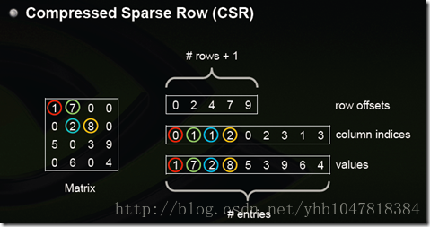
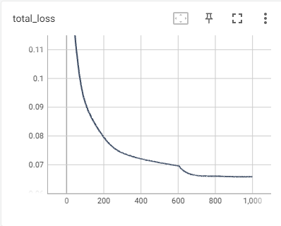
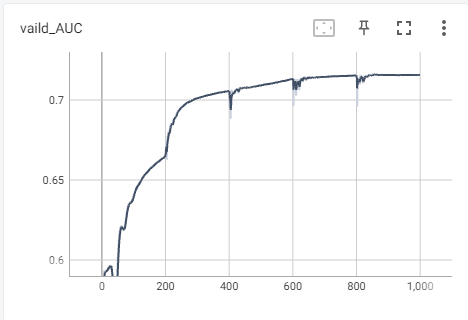
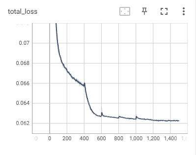

# 1 安装问题

## 1.1 pip和pip3

python 有python2和python3的区别
那么pip也有pip和pip3的区别
大概是这样的
1、pip是python的包管理工具，pip和pip3版本不同，都位于Scripts\目录下：
2、如果系统中只安装了Python2，那么就只能使用pip。
3、如果系统中只安装了Python3，那么既可以使用pip也可以使用pip3，二者是等价的。
4、如果系统中同时安装了Python2和Python3，则pip默认给Python2用，pip3指定给Python3用。
5、重要：虚拟环境中，若只存在一个python版本，可以认为在用系统中pip和pip3命令都是相同的

## 1.2 requirements.txt生成与安装

```bash
pip freeze > requirements.txt
pip install -r requirements.txt  -i https://pypi.tuna.tsinghua.edu.cn/simple/
conda install --yes --file requirements.txt
```

## 1.3 torch和torchvision版本对应关系


## 1.4 升级conda环境python版本

进入虚拟环境，

```bash
conda install python=3.8.0
```

## 1.5 指定版本的torch

先去官网下载对应的安装包，可行性更高

```sh
pip install https://download.pytorch.org/whl/cu101/torch-1.4.0-cp38-cp38-win_amd64.whl

pip install https://download.pytorch.org/whl/cu101/torchvision-0.5.0-cp38-cp38-win_amd64.whl
```

## 1.6 安装指定版本的torch_sparse和torch_scatter

https://pytorch-geometric.com/whl/index.html

下载安装包，然后再安装

## 1.7 GNN任务所需要的安装包

```
numpy==1.18.5
# 下面几个直接pip或下载都可以
torch==1.4.0
torchvision==0.5.0
torch_geometric==1.7.0
# 必须要下载后再pip
torch_scatter==2.0.3
torch_sparse==0.5.1
```

按照1.3-1.6的教程，依次安装即可

## 1.8 conda env list

查看需虚拟环境列表

# 2 python 问题

## 2.1 @property

### 1.修饰方法，是方法可以像属性一样访问。

```python
class DataSet(object):
  @property
  def method_with_property(self): ##含有@property
      return 15
  def method_without_property(self): ##不含@property
      return 15

l = DataSet()
print(l.method_with_property) # 加了@property后，可以用调用属性的形式来调用方法,后面不需要加（）。
print(l.method_without_property())  #没有加@property , 必须使用正常的调用方法的形式，即在后面加()
```

两个都输出为15。

## 2.2 字符串前加字母的含义

- **字符串前加f**

表示字符串内支持大括号内的python表达式，如：

```python
logger.info(f"Total time taken: {time.time() - start_time}")
```

- **字符串前加r**

去掉反斜杠的转移机制，如下面例子，表示单纯字符串而不表示换行

```python
logger.info(r"Test\n\n\n")
```

- **字符串前加u**

一般出现在中文字符串前，防止出现乱码

- **字符串前加b**

表示这是一个bytes类型对象，在网络编程中，服务器和浏览器只认bytes类型数据，如：

```python
response=b'<h1>Hello World</h1>'
```

## 2.3 shutil.rmtree

删除文件夹以及文件夹内的所有文件

# 3 torch_geometric

## 3.1 创建 “In Memory Datasets”

In order to create a [`torch_geometric.data.InMemoryDataset`](https://pytorch-geometric.readthedocs.io/en/latest/modules/data.html#torch_geometric.data.InMemoryDataset), you need to implement four fundamental methods:

- [`torch_geometric.data.InMemoryDataset.raw_file_names()`](https://pytorch-geometric.readthedocs.io/en/latest/modules/data.html#torch_geometric.data.InMemoryDataset.raw_file_names): A list of files in the `raw_dir` which needs to be found in order to skip the download.
- [`torch_geometric.data.InMemoryDataset.processed_file_names()`](https://pytorch-geometric.readthedocs.io/en/latest/modules/data.html#torch_geometric.data.InMemoryDataset.processed_file_names): A list of files in the `processed_dir` which needs to be found in order to skip the processing.
- `torch_geometric.data.InMemoryDataset.download()`: Downloads raw data into `raw_dir`.
- `torch_geometric.data.InMemoryDataset.process()`: Processes raw data and saves it into the `processed_dir`.

## 3.2 AUC评估方式

https://www.zhihu.com/question/39840928

## 3.3 model.train/eval

- **model.train()**

在使用 pytorch 构建神经网络的时候，训练过程中会在程序上方添加一句model.train()，作用是 启用 batch normalization 和 dropout 。

如果模型中有BN层（Batch Normalization）和 Dropout ，需要在 训练时 添加 model.train()。

model.train() 是保证 BN 层能够用到 每一批数据 的均值和方差。对于 Dropout，model.train() 是 随机取一部分 网络连接来训练更新参数。

- **model.eval()**

model.eval()的作用是 不启用 Batch Normalization 和 Dropout。

如果模型中有 BN 层（Batch Normalization）和 Dropout，在 测试时 添加 model.eval()。

model.eval() 是保证 BN 层能够用 全部训练数据 的均值和方差，即测试过程中要保证 BN 层的均值和方差不变。对于 Dropout，model.eval() 是利用到了 所有 网络连接，即不进行随机舍弃神经元


## 3.4 with torch.no_grad()

测试的时候使用，不进行反向传播

## 3.5 loss.item

将只有一个元素的张量当作浮点数字返回

## 3.6 在GPU上加速

有以下几点需要加上`to(device)`或`cuda(device)`

- 模型是否放到了CUDA上 `model = model.to(device)` 或 `model = model.cuda(device)`
- 输入数据是否放到了CUDA上 `data = data.to(device)` 或 `data = data.cuda(device)`
- 模型内部新建的张量是否放到了CUDA上 `p = torch.tensor([1]).to(device)` 或 `p = torch.tensor([1]).cuda(device)`
  一般情况下应该是忘记了第三点，而根据提示也可以知道，在进行二分类交叉熵损失进行前向计算的过程中，存在没有放到cuda上的张量，找到他，fix it ！！！

注：`device = f'cuda:{device}' if torch.cuda.is_available() else 'cpu'`

## 3.7 Tensorboard

- `from torch.utils.tensorboard import SummaryWriter`
- `writer = SummaryWriter("./results/tb_results")`
- `writer.add_scalar('total_loss', loss, epoch)`
- 终端：`tensorboard --logdir=./results/tb_results --port=6007`

## 3.8 图连接形式

- **邻接矩阵Adjacency Matrix**

N*N矩阵，

- **稀疏矩阵**

  - **COO：**每一个元素需要用一个三元组来表示，分别是（行号，列号，数值）

  

  - **Compressed Sparse Row (CSR)**：CSR是比较标准的一种，也需要三类数据来表达：数值，列号，以及行偏移。CSR不是三元组，而是整体的编码方式。数值和列号与COO一致，表示一个元素以及其列号，行偏移表示某一行的第一个元素在values里面的起始偏移位置。如上图中，第一行元素1是0偏移，第二行元素2是2偏移，第三行元素5是4偏移，第4行元素6是7偏移。在行偏移的最后补上矩阵总的元素个数，本例中是9。

    

- **dense_to_sparse** **(** *adj* **)**

将密集邻接矩阵转换为由边缘索引和边缘属性定义的稀疏邻接矩阵

- ToSparseTensor

Converts the `edge_index` attributes of a homogeneous or heterogeneous data object into a (transposed) `torch_sparse.SparseTensor` type with key `adj_t` (functional name: `to_sparse_tensor`)

- **将adj_t转化为edge_index**

由于此功能仍处于试验阶段，某些操作，*例如*图池方法，可能仍需要您输入`edge_index`格式。您可以通过以下方式转换`adj_t`回：`(edge_index, edge_attr)`

## 3.9 nll_loss

（input，traget）：target必须是一维的，**target = traget.squeeze(1)**


## 3.10 GPU上使用adj_t

adj_t.cuda()

# 4 服务器连接

## 4.1 实验室配置成服务器

将ubuntu系统设置为服务器很简单，只需要开启ssh服务就可以了。

- 安装`openssh-server`：`sudo apt-get install openssh-server`
- `ssh localhost`测试能否建立连接，根据yes回车；
- 测试ssh服务是否开启：`ps -e |grep ssh`

接下来就是VSCode远程连接

- 获取服务器ip：`ifconfig`

```bash
cjh@210.32.151.20:/home/cjh/GNN
```

- windows端在vscode上安装插件：`remote-ssh`
- config文件配置


```bash
# Read more about SSH config files: https://linux.die.net/man/5/ssh_config
Host cjh
    HostName 210.32.151.20 #服务器ip，就是刚才我们ping通的那个
    User cjh # 服务器上的用户名
    Port 22 # ssh端口，一般默认22， 可以修改

```

- 文件->首选项->设置->搜索框中搜索 remote-ssh 找到以下选项打勾即可


## 4.2 服务器传文件

```bash
# ！！！！！！注意要在windows上运行指令！！！！！！
# 将本地文件上传到服务器
scp F:\研究生\课程\人工智能概论\GNN cjh@210.32.151.20:/home/cjh/GNN
scp F:\研究生\课程\人工智能概论\GNN\笔记.md cjh@210.32.151.20:/home/cjh/GNN

# 将本地目录上传到服务器 
scp -r F:\研究生\课程\人工智能概论\GNN cjh@210.32.151.20:/home/cjh/GNN

# ！！！！！！注意要在linux上运行指令！！！！！！
# 从服务器端拉取文件
scp -r cjh@210.32.151.20:/home/cjh/GNN/results F:\研究生\课程\人工智能概论\GNN
scp -r cjh@210.32.151.20:/home/cjh/GNN/gat.py F:\研究生\课程\人工智能概论\GNN

详细参数：
    -p 拷贝文件的时候保留源文件建立的时间。 
    -q 执行文件拷贝时，不显示任何提示消息。 
    -r 拷贝整个目录 。
    -v 拷贝文件时，显示提示信息。
```


## 4.3 ssh远程连接之后配置python环境

安装python拓展，直接将本地的插件安装在远程，此时即可实现高亮

# 5 实验结果

## 5.1 mlp

4层，400个epoch结果最好：73.3；500次、600次均过拟合


## 5.2 GCN

- 隐藏层16通道，1000个epoch，




## 5.3 GAT

- 目前的配置：2个head，隐藏层16，1000epoch，测试集精度为73.8





## 5.4 GraphSAGE

### 5.4.1 最简单的配置：2层，隐藏层16，1500epoch，测试的AUC为 0.769.




### 5.4.2 配置：2层，隐藏64，2500epoch，测试的AUC为 0.779.


### 5.4.3 配置：3层，隐藏64，2500epoch，测试的AUC为 0.791.


### 5.4.4 配置：3层，隐藏64，6000epoch，测试的AUC为 0.802.激活函数为elu


